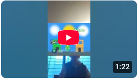

# City Update

ENG | [ESP](https://github.com/nico1monte/city_update/blob/main/README.es_ES.md)

City Update is a project from Informatioa that it's a videogame which simulates the city of Montevideo. You can watch more information with this video:

<<<<<<< HEAD

  

=======

  <picture>
    <source media="(prefers-color-scheme: dark)" srcset="./readme_pictures/short-city_update_presentation.PNG">
    
  </picture>

[Click to watch!](https://www.youtube.com/shorts/-fL3rMuZjq0)
>>>>>>> 0aa93228e49ae96687c6bdbf727c1baeb731f1c1

Creator: [@nico1monte](https://github.com/nico1monte)
